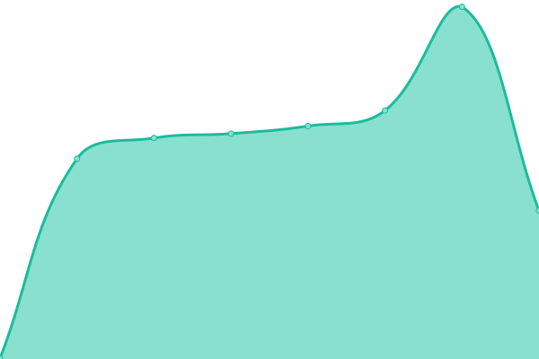
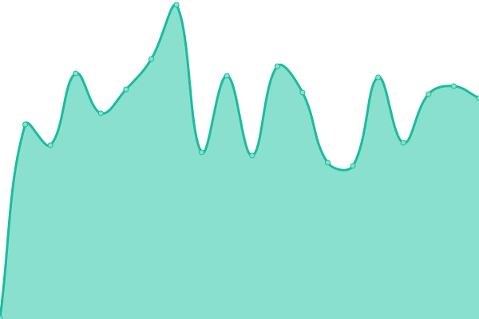

# [📈 Live Status](https://demo.upptime.js.org): <!--live status--> **🟧 Partial outage**

This repository contains the open-source uptime monitor and status page for [Effect Digital](https://www.effectdigital.com/), powered by [Upptime](https://github.com/upptime/upptime).

With [Upptime](https://upptime.js.org), you can get your own unlimited and free uptime monitor and status page, powered entirely by a GitHub repository. We use [Issues](https://github.com/effect-digital/wol-olympus-status/issues) as incident reports, [Actions](https://github.com/effect-digital/wol-olympus-status/actions) as uptime monitors, and [Pages](https://demo.upptime.js.org) for the status page.

<!--start: status pages-->
<!-- This summary is generated by Upptime (https://github.com/upptime/upptime) -->
<!-- Do not edit this manually, your changes will be overwritten -->
<!-- prettier-ignore -->
| URL | Status | History | Response Time | Uptime |
| --- | ------ | ------- | ------------- | ------ |
|  [Olympus](https://api.olympustech.ai/up) | 🟩 Up | [olympus.yml](https://github.com/effect-digital/wol-olympus-status/commits/HEAD/history/olympus.yml) | 

 857ms
     
 | 

<a href="https://status.olympustech.ai/history/olympus">100.00%</a>
    

|  [Marketing](https://everest.wayoflife.com/up) | 🟩 Up | [marketing.yml](https://github.com/effect-digital/wol-olympus-status/commits/HEAD/history/marketing.yml) | 

 553ms
     
 | 

<a href="https://status.olympustech.ai/history/marketing">100.00%</a>
    

|  [Customer & Property Management](https://portal.wayoflife.com/up) | 🟩 Up | [customer-and-property-management.yml](https://github.com/effect-digital/wol-olympus-status/commits/HEAD/history/customer-and-property-management.yml) | 

 817ms
     
 | 

<a href="https://status.olympustech.ai/history/customer-and-property-management">100.00%</a>
    

|  [Tenants API](https://tenants.api.wayoflife.com/health) | 🟩 Up | [tenants-api.yml](https://github.com/effect-digital/wol-olympus-status/commits/HEAD/history/tenants-api.yml) | 

 796ms
     
 | 

<a href="https://status.olympustech.ai/history/tenants-api">100.00%</a>
    

|  [Internal Qube API](https://qube.api.wayoflife.com/up) | 🟩 Up | [internal-qube-api.yml](https://github.com/effect-digital/wol-olympus-status/commits/HEAD/history/internal-qube-api.yml) | 

 442ms
     
 | 

<a href="https://status.olympustech.ai/history/internal-qube-api">100.00%</a>
    

|  [Qube Service](https://2617-portals.qubeglobalcloud.com/qubews/?wsdl) | 🟩 Up | [qube-service.yml](https://github.com/effect-digital/wol-olympus-status/commits/HEAD/history/qube-service.yml) | 

 938ms
     
 | 

<a href="https://status.olympustech.ai/history/qube-service">100.00%</a>
    

|  [Multi Family](https://www.wayoflife.com/) | 🟩 Up | [multi-family.yml](https://github.com/effect-digital/wol-olympus-status/commits/HEAD/history/multi-family.yml) | 

 1556ms
     
 | 

<a href="https://status.olympustech.ai/history/multi-family">100.00%</a>
    

|  [Students](https://student.wayoflife.com/) | 🟩 Up | [students.yml](https://github.com/effect-digital/wol-olympus-status/commits/HEAD/history/students.yml) | 

 815ms
     
 | 

<a href="https://status.olympustech.ai/history/students">100.00%</a>
    

|  [The Eades](https://theeades.com/) | 🟩 Up | [the-eades.yml](https://github.com/effect-digital/wol-olympus-status/commits/HEAD/history/the-eades.yml) | 

 771ms
     
 | 

<a href="https://status.olympustech.ai/history/the-eades">100.00%</a>
    

|  [The Draper](https://thedraper.com/) | 🟥 Down | [the-draper.yml](https://github.com/effect-digital/wol-olympus-status/commits/HEAD/history/the-draper.yml) | 

 633ms
     
 | 

<a href="https://status.olympustech.ai/history/the-draper">99.77%</a>
    

|  [Single Family](https://home.wayoflife.com/) | 🟩 Up | [single-family.yml](https://github.com/effect-digital/wol-olympus-status/commits/HEAD/history/single-family.yml) | 

 4862ms
     
 | 

<a href="https://status.olympustech.ai/history/single-family">100.00%</a>
    

|  [Rightmove](https://adfapi.rightmove.co.uk/) | 🟩 Up | [rightmove.yml](https://github.com/effect-digital/wol-olympus-status/commits/HEAD/history/rightmove.yml) | 

 938ms
     
 | 

<a href="https://status.olympustech.ai/history/rightmove">100.00%</a>
    

|  [Netlify](https://www.netlifystatus.com/api/v2/status.json) | 🟩 Up | [netlify.yml](https://github.com/effect-digital/wol-olympus-status/commits/HEAD/history/netlify.yml) | 

 304ms
     
 | 

<a href="https://status.olympustech.ai/history/netlify">99.05%</a>
    

|  [Cloudflare](https://www.cloudflarestatus.com/api/v2/status.json) | 🟨 Degraded | [cloudflare.yml](https://github.com/effect-digital/wol-olympus-status/commits/HEAD/history/cloudflare.yml) | 

 243ms
     
 | 

<a href="https://status.olympustech.ai/history/cloudflare">99.97%</a>
    

|  [Storyblok](https://api.storyblok.com/v2/cdn/spaces/me) | 🟩 Up | [storyblok.yml](https://github.com/effect-digital/wol-olympus-status/commits/HEAD/history/storyblok.yml) | 

 243ms
     
 | 

<a href="https://status.olympustech.ai/history/storyblok">100.00%</a>
    

<!--end: status pages-->

[**Visit our status website →**](https://demo.upptime.js.org)

## 📄 License

- Powered by: [Upptime](https://github.com/upptime/upptime)
- Code: [MIT](./LICENSE) © [Anand Chowdhary](https://anandchowdhary.com), supported by [Pabio](https://pabio.com)
- Data in the `./history` directory: [Open Database License](https://opendatacommons.org/licenses/odbl/1-0/)
