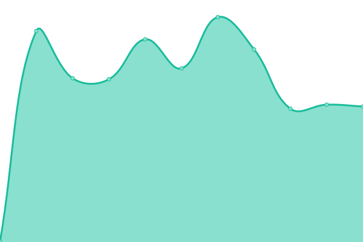
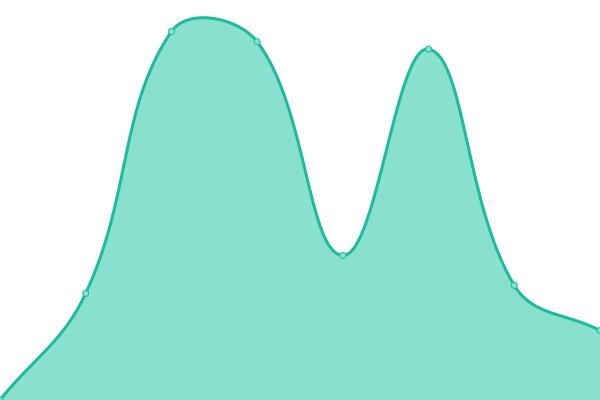
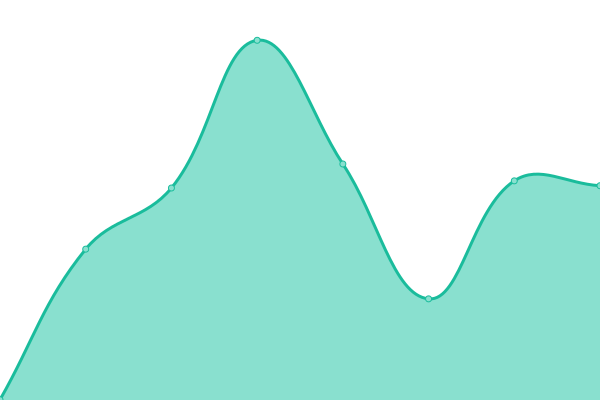
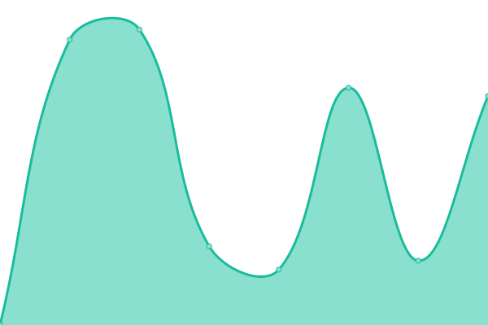
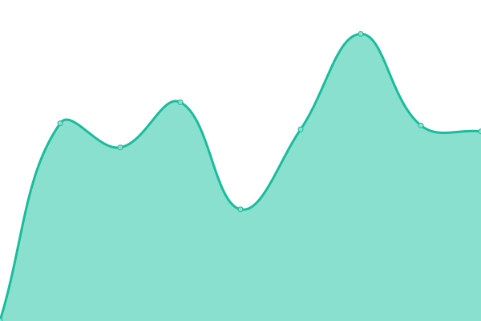
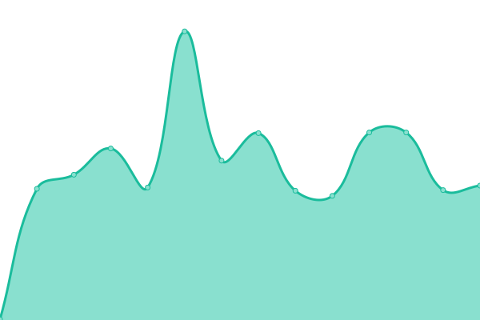

# [📈 Live Status](https://demo.upptime.js.org): <!--live status--> **🟩 All systems operational**

This repository contains the open-source uptime monitor and status page for [Effect Digital](https://www.effectdigital.com/), powered by [Upptime](https://github.com/upptime/upptime).

With [Upptime](https://upptime.js.org), you can get your own unlimited and free uptime monitor and status page, powered entirely by a GitHub repository. We use [Issues](https://github.com/effect-digital/wol-olympus-status/issues) as incident reports, [Actions](https://github.com/effect-digital/wol-olympus-status/actions) as uptime monitors, and [Pages](https://demo.upptime.js.org) for the status page.

<!--start: status pages-->
<!-- This summary is generated by Upptime (https://github.com/upptime/upptime) -->
<!-- Do not edit this manually, your changes will be overwritten -->
<!-- prettier-ignore -->
| URL | Status | History | Response Time | Uptime |
| --- | ------ | ------- | ------------- | ------ |
|  [Olympus](https://api.olympustech.ai/up) | 🟩 Up | [olympus.yml](https://github.com/effect-digital/wol-olympus-status/commits/HEAD/history/olympus.yml) | 

 865ms
     
 | 

<a href="https://effect-digital.github.io/wol-olympus-status/history/olympus">100.00%</a>
    

|  [Everest](https://everest.wayoflife.com/up) | 🟩 Up | [everest.yml](https://github.com/effect-digital/wol-olympus-status/commits/HEAD/history/everest.yml) | 

 558ms
     
 | 

<a href="https://effect-digital.github.io/wol-olympus-status/history/everest">100.00%</a>
    

|  [Portal](https://portal.wayoflife.com/up) | 🟩 Up | [portal.yml](https://github.com/effect-digital/wol-olympus-status/commits/HEAD/history/portal.yml) | 

 926ms
     
 | 

<a href="https://effect-digital.github.io/wol-olympus-status/history/portal">100.00%</a>
    

|  [Tenants API](https://tenants.api.wayoflife.com/health) | 🟩 Up | [tenants-api.yml](https://github.com/effect-digital/wol-olympus-status/commits/HEAD/history/tenants-api.yml) | 

 663ms
     
 | 

<a href="https://effect-digital.github.io/wol-olympus-status/history/tenants-api">100.00%</a>
    

|  [Internal Qube API](https://qube.api.wayoflife.com/up) | 🟩 Up | [internal-qube-api.yml](https://github.com/effect-digital/wol-olympus-status/commits/HEAD/history/internal-qube-api.yml) | 

 521ms
     
 | 

<a href="https://effect-digital.github.io/wol-olympus-status/history/internal-qube-api">100.00%</a>
    

|  [Qube Service](https://2617-portals.qubeglobalcloud.com/qubews/?wsdl) | 🟩 Up | [qube-service.yml](https://github.com/effect-digital/wol-olympus-status/commits/HEAD/history/qube-service.yml) | 

 1111ms
     
 | 

<a href="https://effect-digital.github.io/wol-olympus-status/history/qube-service">100.00%</a>
    

|  [Multi Family](https://www.wayoflife.com/) | 🟩 Up | [multi-family.yml](https://github.com/effect-digital/wol-olympus-status/commits/HEAD/history/multi-family.yml) | 

 1318ms
     
 | 

<a href="https://effect-digital.github.io/wol-olympus-status/history/multi-family">100.00%</a>
    

|  [Students](https://student.wayoflife.com/) | 🟩 Up | [students.yml](https://github.com/effect-digital/wol-olympus-status/commits/HEAD/history/students.yml) | 

 706ms
     
 | 

<a href="https://effect-digital.github.io/wol-olympus-status/history/students">0.00%</a>
    

|  [The Eades](https://theeades.com/) | 🟩 Up | [the-eades.yml](https://github.com/effect-digital/wol-olympus-status/commits/HEAD/history/the-eades.yml) | 

 878ms
     
 | 

<a href="https://effect-digital.github.io/wol-olympus-status/history/the-eades">100.00%</a>
    

|  [The Draper](https://thedraper.com/) | 🟩 Up | [the-draper.yml](https://github.com/effect-digital/wol-olympus-status/commits/HEAD/history/the-draper.yml) | 

 1085ms
     
 | 

<a href="https://effect-digital.github.io/wol-olympus-status/history/the-draper">100.00%</a>
    

|  [Single Family](https://home.wayoflife.com/) | 🟩 Up | [single-family.yml](https://github.com/effect-digital/wol-olympus-status/commits/HEAD/history/single-family.yml) | 

 4902ms
     
 | 

<a href="https://effect-digital.github.io/wol-olympus-status/history/single-family">100.00%</a>
    

|  [Rightmove](https://adfapi.rightmove.co.uk/) | 🟩 Up | [rightmove.yml](https://github.com/effect-digital/wol-olympus-status/commits/HEAD/history/rightmove.yml) | 

 915ms
     
 | 

<a href="https://effect-digital.github.io/wol-olympus-status/history/rightmove">100.00%</a>
    

|  [Netlify Status](https://www.netlifystatus.com/api/v2/status.json) | 🟩 Up | [netlify-status.yml](https://github.com/effect-digital/wol-olympus-status/commits/HEAD/history/netlify-status.yml) | 

 268ms
     
 | 

<a href="https://effect-digital.github.io/wol-olympus-status/history/netlify-status">100.00%</a>
    

|  [Cloudflare](https://www.cloudflarestatus.com/api/v2/status.json) | 🟩 Up | [cloudflare.yml](https://github.com/effect-digital/wol-olympus-status/commits/HEAD/history/cloudflare.yml) | 

 211ms
     
 | 

<a href="https://effect-digital.github.io/wol-olympus-status/history/cloudflare">100.00%</a>
    

<!--end: status pages-->

[**Visit our status website →**](https://demo.upptime.js.org)

## 📄 License

- Powered by: [Upptime](https://github.com/upptime/upptime)
- Code: [MIT](./LICENSE) © [Anand Chowdhary](https://anandchowdhary.com), supported by [Pabio](https://pabio.com)
- Data in the `./history` directory: [Open Database License](https://opendatacommons.org/licenses/odbl/1-0/)
